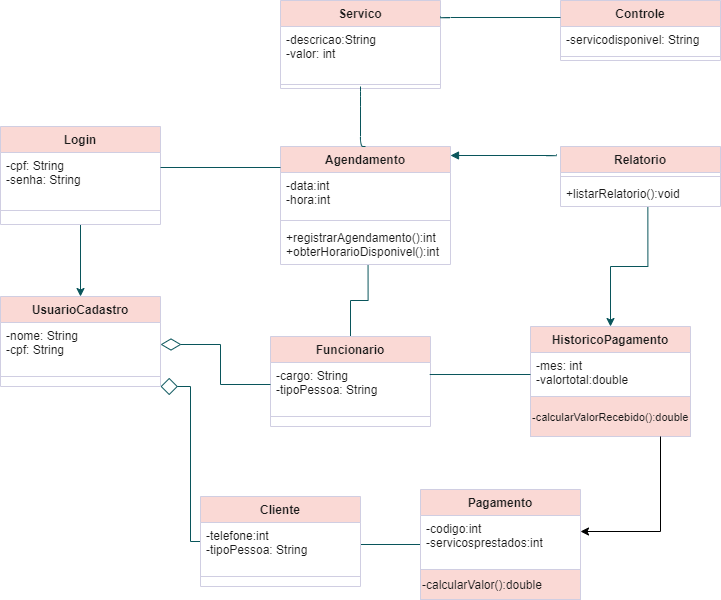
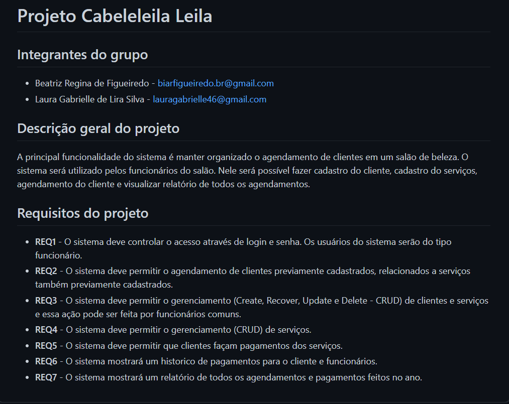

# Projeto Cabeleleila Leila 

## Integrantes do grupo 

 * Beatriz Regina de Figueiredo - biarfigueiredo.br@gmail.com
 * Laura Gabrielle de Lira Silva - lauragabrielle46@gmail.com

## Descrição geral do projeto 

A principal funcionalidade do sistema é manter organizado o agendamento de clientes em um salão de beleza. O sistema será utilizado pelos funcionários do salão. Nele será possível fazer cadastro do cliente, cadastro do serviços, agendamento do cliente e visualizar relatório de todos os agendamentos.   

## Requisitos do projeto

* **REQ1** - O sistema deve controlar o acesso através de login e senha. Os usuários do sistema serão do tipo funcionário.
* **REQ2** - O sistema deve permitir o agendamento de clientes previamente cadastrados, relacionados a serviços também previamente cadastrados.
* **REQ3** - O sistema deve permitir o gerenciamento (Create, Recover, Update e Delete - CRUD) de clientes e serviços e essa ação pode ser feita por funcionários comuns.
* **REQ4** - O sistema deve permitir o gerenciamento (CRUD) de serviços.
* **REQ5** - O sistema deve permitir que clientes façam pagamentos dos serviços.
* **REQ6** - O sistema mostrará um historico de pagamentos para o cliente e funcionários.
* **REQ7** - O sistema mostrará um relatório de todos os agendamentos e pagamentos feitos no ano.

## Diagrama de Classes

* Link de vídeo:

